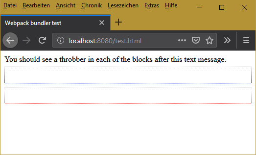

# Test demonstrating webpack issue
Having two different webpack rules setup for the same file type but
assigned to different set of files (by means of `include`, `exclude`, `issuer`)
fails if files affected by one rule import files affected by the other rule.

This is particularly true for image files used in a style file and passed through
`url-loader`.

This repository demonstrates the issue and is an attachment to
[issue 178](/webpack-contrib/url-loader/issues/178) at webpack url-loader repository.

# Steps to Reproduce
To reproduce the issue, clone this repository to your local file.

Then run `npm install`.

After successful installation, run the following script to build the project
and start the development web server:

```batch
npm run buildAndRun:Dev
```
This will start `webpack-dev-server` at `http://localhost:8080/`.

Open `http://localhost:8080/test.html` to see the effect.

# Details

## Setup

This sample project contains three components, establishing an import chain:

1. The `test.html` web page imports the `outer-wc` web component.
1. The `outer-wc` web component itself imports the `inner-wc` web component.

   

The inner web component utilizes `url-loader` for importing its images, stored in a
`SCSS` file:

```js
{
  test: /\.(png)|(svg)|(je?pg)|(gif)$/i,
  use: 'url-loader',
  issuer: {
    include: /src[/\\]inner[/\\].*\.(ts)|(scss)$/
  }
}
```

```css
inner-wc > div
{
  background: white url("../img/Throbber.gif") center no-repeat;
}
```

The outer web component, however, utilizes `file-loader` for importing its images,
stored in a `SCSS` file:

```js
{
  test: /\.(png)|(svg)|(je?pg)|(gif)$/i,
  use: {
    loader: 'file-loader',
    options: {
      outputPath: 'images',
      name: "[name].[ext]"
    }
  },
  issuer: {
    include: /src[/\\]outer[/\\].*\.(ts)|(scss)$/
  }
}
```

```css
outer-wc > div.outer
{
  background: white url("../img/Throbber.gif") center no-repeat;
}
```

*(Note: This is a sample repository, boiled down to demonstrate the issue.)*

# Webpack's Erroneous Result

1. The `data:` URL generated by `url-loader` for the styles on `inner-wc` isn't
   the BASE64 encoded binary image data. Instead, it's the BASE64 encoded JavaScript
	 string:

   ```js
   'module.exports = __webpack_public_path__ + \"images/Throbber.gif\";'
   ```

2. While `file-loader` copies the image file to the `dist` folder, the styles generated
   by it don't refer to the copied image file, instead, a `data:` URL is falsely generated.
	 Moreover - again - the `data:` URL doesn't contain a BASE64 encoded binary image data.
	 Instead, it's the above BASE64 encoded JavaScript string.

# Expected Result

In this setup ...

1. `url-loader` should create a valid BASE64 encoded image URL for `inner-wc`, but not
   for `outer-wc`.

2. `file-loader` should not only copy the image file but also set the correct URL in the
   style sheet.

# Conclusion
<br/>

### This is the expected result


<br/>

### This is actual result


